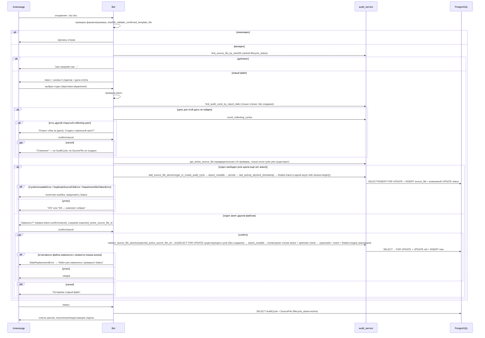

# Stage 3, часть 1: недельный цикл и приём файлов в боте

## Подтверждённая таблица (read-only проверка перед реализацией)

| Файл (отдел) | Существует | Валиден | Дата отчёта |
|---|---|---|---|
| Региональный | да | True | 30.07.2026 |
| Москва | да | True | 30.07.2026 |
| СЗФО-2 | да | True | 30.07.2026 |
| Фокин | да | True | 30.07.2026 |
| СЗФО-1 | да | True | 30.07.2026 |

Все 5 — одной датой, все валидны. Это подтверждает, что реальный комплект технически образует 5/5 → `completed`. Эти реальные файлы **не становятся** тестовыми fixtures (персональные данные, `docs/ASSUMPTIONS.md` §3) — интеграционные тесты используют анонимизированные fixtures из `tests/fixtures/regional/`, параметризованные по всем 5 `Department`.

## Preflight существующих `source_files` (read-only, выполнено перед реализацией)

| Проверка | Результат |
|---|---|
| Всего строк в `source_files` (dev БД `debitor_bot`@`localhost`) | **0** |
| Совпадений `sha256` реальных 5 файлов с БД | **0/5** |

Таблица пуста — сценарий «Stage 2 legacy-строки с `audit_cycle_id=NULL`, конфликтующие с новым дедупом» неактуален на момент реализации. Backfill/adoption старых `SourceFile` в `AuditCycle` **не требуется**. Если к моменту фактического запуска миграции в БД появятся данные — тот же preflight-запрос повторяется перед `upgrade`, и при обнаружении совпадений реализация останавливается для отдельного решения (не удаляется и не адаптируется молча).

## Принятые решения

1. **Отдел определяется вручную** — после успешной валидации файла бот показывает 5 кнопок отделов, Александр выбирает сам (закрывает `docs/ASSUMPTIONS.md` §1.1).
2. **Замена файла отдела** — inline-подтверждение (`Заменить` / `Оставить старый`), атомарно, с сохранением истории (см. ниже), не жёсткое удаление.
3. **`completed` — только при строгом 5/5** одной `report_date`. Никакого перехода в `completed` по таймауту или иным способом при неполном комплекте.
4. **`completed`-цикл неизменяем** в части 1: загрузка/замена файлов такого цикла блокируется. «Переоткрыть аудит» — отдельный механизм, follow-up.
5. **Idle timeout, напоминания и присвоение `EXPIRED` не входят в часть 1.** Значение `EXPIRED` только зарезервировано в enum (чтобы не делать вторую миграцию enum позже). **Неполный цикл никогда не становится `COMPLETED`** — ни по таймауту, ни каким-либо иным способом, кроме строгого 5/5.

## Архитектурное решение: AuditCycle привязан к report_date

`AuditCycle.report_date` — уникальное поле, дата берётся из самого файла (`ParsedSourceFile.report_date`). Файл с другой датой создаёт новый `AuditCycle`, а не конфликт в существующем. Если уже есть `collecting`-цикл с другой датой, бот запрашивает явное подтверждение перед созданием второго (см. «Хендлеры», шаг 2).

## Модель данных

### [app/domain/models/audit_cycle.py](app/domain/models/audit_cycle.py) (новый файл)

**Критично:** обычный `Enum(PythonEnumClass)` в SQLAlchemy по умолчанию сохраняет **имена** элементов (`COLLECTING`, `ACTIVE`), а не их `.value` (`collecting`, `active`). Миграция создаёт lowercase-значения в PostgreSQL enum — без `values_callable` ORM будет пытаться писать `"COLLECTING"` в тип, где допустимо только `"collecting"`, и упадёт на каждой записи. Обе enum-колонки должны явно задавать `values_callable` + `validate_strings=True`:

```python
class AuditCycleStatus(str, enum.Enum):
    COLLECTING = "collecting"
    COMPLETED = "completed"
    EXPIRED = "expired"  # зарезервировано для части 2 (idle timeout); в части 1 не присваивается

class AuditCycle(Base):
    __tablename__ = "audit_cycles"
    __table_args__ = (UniqueConstraint("report_date", name="uq_audit_cycle_report_date"),)

    id: Mapped[int] = mapped_column(primary_key=True)
    report_date: Mapped[dt.date] = mapped_column(Date, nullable=False)
    status: Mapped[AuditCycleStatus] = mapped_column(
        Enum(
            AuditCycleStatus,
            name="audit_cycle_status",
            values_callable=lambda enum_cls: [item.value for item in enum_cls],
            validate_strings=True,
        ),
        nullable=False,
    )
    created_at: Mapped[dt.datetime] = mapped_column(..., server_default=func.now())
    last_activity_at: Mapped[dt.datetime] = mapped_column(..., server_default=func.now())  # начальное значение при создании строки
    completed_at: Mapped[dt.datetime | None] = mapped_column(nullable=True)

    source_files: Mapped[list["SourceFile"]] = relationship(back_populates="audit_cycle")
```

`EXPIRED` вводится в enum сразу (чтобы не делать вторую миграцию enum ради одного значения — Postgres ADD VALUE необратим без пересоздания типа, дешевле завести сразу), но **не присваивается никаким кодом в части 1** — только `COLLECTING`/`COMPLETED`.

### [app/domain/models/source_file.py](app/domain/models/source_file.py) — изменения

- `audit_cycle_id: Mapped[int | None] = mapped_column(ForeignKey("audit_cycles.id"), nullable=True)` (nullable — не ломает Stage 2 тесты, вызывающие `persist_valid_source_file` без цикла);
- **новое поле** `lifecycle_status` (точное определение колонки — см. «Синхронизация Enum-значений» ниже, с `values_callable`/`validate_strings=True`) — отдельный enum от существующего `SourceFileStatus` (valid/invalid — структурная валидация, не трогаем):

```python
class SourceFileLifecycle(str, enum.Enum):
    ACTIVE = "active"
    SUPERSEDED = "superseded"  # заменён более новым файлом того же отдела/цикла; НЕ удаляется
```

- relationship `audit_cycle`.

**Почему не удаляем старый файл физически:** удаление стирало бы `sha256` из БД — глобальный дедуп «точный дубликат отклоняется» перестал бы работать (тот же файл можно было бы закинуть повторно). `SUPERSEDED`-строка остаётся, её `sha256` остаётся уникальным и продолжает участвовать в проверке дубликатов; отчёты/комплектность фильтруют только `lifecycle_status == ACTIVE`.

### Защита от гонки на уровне PostgreSQL

Частичный уникальный индекс (не обычный `UniqueConstraint`, т.к. ограничение должно действовать только для активных файлов):

```python
op.create_index(
    "uq_source_file_active_per_department",
    "source_files",
    ["audit_cycle_id", "department"],
    unique=True,
    postgresql_where=sa.text("lifecycle_status = 'active'"),
)
```

Это гарантирует на уровне БД: **в одном `AuditCycle` не может быть двух `active` файлов одного отдела**, даже при двух почти одновременных callback (второй `INSERT`/`UPDATE` упадёт с `IntegrityError`, сервис перехватывает и отвечает «уже обработано параллельно, обновите статус» — не паникует).

### Новая Alembic-миграция

**Создание типов и таблиц (upgrade), точный порядок:**

1. `audit_cycle_status_enum = postgresql.ENUM("collecting", "completed", "expired", name="audit_cycle_status")` → `audit_cycle_status_enum.create(op.get_bind(), checkfirst=True)` — тип создаётся явно один раз, до использования в колонках/таблицах.
2. `source_file_lifecycle_enum = postgresql.ENUM("active", "superseded", name="source_file_lifecycle")` → `source_file_lifecycle_enum.create(op.get_bind(), checkfirst=True)`.
3. `op.create_table("audit_cycles", ..., sa.Column("status", postgresql.ENUM(..., name="audit_cycle_status", create_type=False), nullable=False), ...)` — таблица использует уже созданный тип с `create_type=False` (иначе SQLAlchemy попытается создать тип повторно и упадёт на `DuplicateObject`).
4. `op.add_column("source_files", sa.Column("audit_cycle_id", sa.Integer(), sa.ForeignKey("audit_cycles.id"), nullable=True))`.
5. `op.add_column("source_files", sa.Column("lifecycle_status", postgresql.ENUM(..., name="source_file_lifecycle", create_type=False), nullable=True, server_default="active"))` — сначала `nullable=True` + `server_default="active"`, чтобы существующие строки Stage 2 (если появятся к моменту применения — см. preflight выше) сразу получили значение без отдельного `UPDATE`.
6. `op.alter_column("source_files", "lifecycle_status", nullable=False)` — только после того, как server_default гарантированно применён ко всем существующим строкам.
7. Частичный уникальный индекс с точным predicate:

```python
op.create_index(
    "uq_source_file_active_per_department",
    "source_files",
    ["audit_cycle_id", "department"],
    unique=True,
    postgresql_where=sa.text("lifecycle_status = 'active'"),
)
```

**Модель `SourceFile` отражает тот же `server_default`**, чтобы `metadata` (используемая в тестах/`alembic autogenerate`) не расходилась с фактической схемой:

```python
lifecycle_status: Mapped[SourceFileLifecycle] = mapped_column(
    Enum(
        SourceFileLifecycle,
        name="source_file_lifecycle",
        values_callable=lambda enum_cls: [item.value for item in enum_cls],
        validate_strings=True,
    ),
    nullable=False,
    server_default=SourceFileLifecycle.ACTIVE.value,
)
```

Все четыре места обязаны использовать одинаковые lowercase-значения — проверяется явно как часть реализации, не только «по построению»: (1) `class ... (str, enum.Enum)` — `.value` в нижнем регистре; (2) `values_callable` на колонке модели; (3) значения, перечисленные в Alembic `postgresql.ENUM("collecting", "completed", "expired", ...)`; (4) predicate частичного индекса `lifecycle_status = 'active'`. Тест `tests/integration/test_enum_values_roundtrip.py` записывает и читает через ORM (не через raw SQL) все значения обоих enum на реальном PostgreSQL — если где-то регистр или набор значений расходится, тест ловит это как `LookupError`/`DataError` при `INSERT`, а не только по совпадению строк в коде.

**Порядок `downgrade()` — строго обратный upgrade, зависимости раньше типов, от которых они зависят:**

1. `op.drop_index("uq_source_file_active_per_department", table_name="source_files")`;
2. `op.drop_column("source_files", "lifecycle_status")`;
3. `op.drop_constraint(<fk_name>, "source_files", type_="foreignkey")` затем `op.drop_column("source_files", "audit_cycle_id")`;
4. `op.drop_table("audit_cycles")` — **только после** удаления FK/колонки, которая на неё ссылается, и только после того, как ничто больше не ссылается на `audit_cycle_status`;
5. `postgresql.ENUM(name="source_file_lifecycle").drop(op.get_bind(), checkfirst=True)` — только теперь, когда колонка `source_files.lifecycle_status` уже удалена (без этого порядка Postgres откажет: `cannot drop type ... because other objects depend on it`);
6. `postgresql.ENUM(name="audit_cycle_status").drop(op.get_bind(), checkfirst=True)` — только теперь, когда таблица `audit_cycles` (последний объект, использующий этот тип) уже удалена.

Проверяется как часть реализации (не отдельным ручным шагом «потом»): `alembic upgrade head` → `alembic downgrade -1` → `alembic upgrade head` — на чистой базе; отдельно — на базе, где уже применены все Stage 2 миграции (та же цепочка команд), чтобы подтвердить, что `server_default` и порядок downgrade корректны и при существующих строках `source_files`.

## Сервисный слой: [app/application/audit_service.py](app/application/audit_service.py) (новый)

Вся бизнес-логика — здесь, без завязки на aiogram, полностью юнит/интеграционно тестируема. Хендлер **никогда** не вызывает `persist_valid_source_file` и `finalize_if_complete` напрямую и по отдельности — только через `add_source_file_atomic`/`replace_source_file_atomic`, чтобы между «сохранили файл» и «пересчитали комплектность» не было окна для гонки.

### Session lifecycle — точный контракт (устраняет конфликт `AsyncSession` autobegin)

**Выбранный вариант: одна и та же `AsyncSession` на весь хендлер, но предварительные read-only проверки выполняются как отдельные, полностью завершённые транзакции, а не как «висящий» неявный autobegin.** Не вариант с отдельным `async_sessionmaker`/второй сессией — это усложнило бы FSM (два соединения на одну логическую операцию) без выигрыша.

Проблема: `AsyncSession` в SQLAlchemy 2.x по умолчанию в режиме autobegin — первый же `SELECT` (например, `find_source_file_by_sha256`) неявно открывает транзакцию, которая остаётся **открытой**, пока явно не вызван `commit()`/`rollback()`. Если после нескольких таких `SELECT` хендлер вызывает `add_source_file_atomic`, а та внутри пытается `async with session.begin()` — SQLAlchemy поднимает `InvalidRequestError: A transaction is already begun on this Session`, потому что transaction уже открыт неявно.

Фикс — явный контракт для каждой read-only проверки в хендлере: **каждая предварительная проверка сама закрывает свою транзакцию сразу после выполнения**, оборачиваясь в `async with session.begin():` (даже для одного `SELECT`) — при штатном выходе из `async with` без исключений это `COMMIT` пустой read-only транзакции (не откат, никаких изменений и так не было), после которого `session.in_transaction()` снова `False`.

**Дополнительная и отдельная проблема (не решается одним закрытием транзакции): `expire_on_commit=True` (стандартная настройка `async_sessionmaker`, её нельзя «обходить» конфигурацией, потому что граница сервисного контракта должна быть явной независимо от настроек).** После `COMMIT` любой ORM-объект, возвращённый из-под `async with session.begin()`, становится expired — обращение к его атрибутам (`.report_date`, `.status`, `.department` и т.п.) уже вне транзакции инициирует неявный ленивый SQL-запрос, а в асинхронном коде без сохранённого greenlet-контекста это приводит к `MissingGreenlet`/`DetachedInstanceError`. Поэтому **read-only функции сервиса не возвращают ORM-объекты наружу вообще** — они формируют immutable DTO (`@dataclass(frozen=True)`) из нужных полей **внутри** своего `async with session.begin()`, пока объект ещё attached и не expired, и возвращают только этот DTO.

**Уточнение, устраняющее второй, более тонкий источник неявного SQL: DTO-функции не должны обращаться ни к одному незагруженному ORM-relationship (например, `row.audit_cycle`), даже находясь строго внутри ещё не закоммиченной транзакции.** Обращение к relationship, для которого не было явного eager-загрузки (`joinedload`/`selectinload`) и не было явного `JOIN` в самом запросе, инициирует implicit lazy-load — тот же самый неявный `SELECT`, который в асинхронном SQLAlchemy без greenlet-контекста может поднять `MissingGreenlet` **даже до commit**, т.е. DTO-обёртка сама по себе не спасает, если построена неаккуратно. Правило для всех `find_*`/`count_*`/`get_*`-функций без исключения:

- **предпочтительный способ** — прямой `select()` с явной проекцией нужных колонок (`select(SourceFile.id, SourceFile.report_date, ...)`), при необходимости с явным `JOIN`/`OUTER JOIN`, и построение DTO из `Row`, а не из смапленного ORM-инстанса — тогда relationship физически не участвует в запросе и не может быть случайно тронут;
- если по каким-то причинам используется `select(Model)` (полный ORM-объект) — читать в DTO только собственные колонки модели (`row.department`, `row.lifecycle_status`), явная eager-загрузка (`selectinload`) допустима, но для простых плоских DTO плоская column-проекция избавляет от этого вопроса вообще и предпочтительнее;
- relationship-атрибуты (`.audit_cycle`, `.source_files`, `.debt_positions` и т.п.) **никогда** не читаются при построении DTO.

Конкретно для `find_source_file_by_sha256`: `SourceFile` уже имеет **собственную** NOT NULL колонку `report_date` (`app/domain/models/source_file.py:43`, заполняется из самого файла при `persist_valid_source_file`, независимо от того, привязан ли файл к `AuditCycle`) — поэтому обращение к `AuditCycle` для получения даты отчёта **не нужно вовсе**, ни через relationship, ни через `JOIN`. Финальная версия — чистая column-проекция без обращения к какой-либо связанной таблице:

```python
@dataclass(frozen=True)
class SourceFileLookup:
    id: int
    report_date: date
    department: Department
    lifecycle_status: SourceFileLifecycle
    audit_cycle_id: int | None  # None — legacy-строка Stage 2, не привязанная ни к какому AuditCycle

async def find_source_file_by_sha256(session: AsyncSession, sha256: str) -> SourceFileLookup | None:
    async with session.begin():
        stmt = select(
            SourceFile.id,
            SourceFile.report_date,
            SourceFile.department,
            SourceFile.lifecycle_status,
            SourceFile.audit_cycle_id,
        ).where(SourceFile.sha256 == sha256)
        row = (await session.execute(stmt)).one_or_none()
        if row is None:
            return None
        return SourceFileLookup(
            id=row.id,
            report_date=row.report_date,
            department=row.department,
            lifecycle_status=row.lifecycle_status,
            audit_cycle_id=row.audit_cycle_id,
        )
```

`report_date` берётся из собственной колонки `SourceFile.report_date` и **всегда** заполнен (`NOT NULL` в схеме, не `date | None`) — «legacy без даты» как сценарий не существует, потому что `report_date` требовался уже в Stage 2 независимо от `AuditCycle`. Легаси-сценарий Stage 2 — это **не** отсутствие `report_date`, а `audit_cycle_id IS NULL` (файл распознан/сохранён до того, как Stage 3 начал привязывать файлы к циклам). Именно поле `audit_cycle_id: int | None` в DTO — сигнал для хендлера:

- `audit_cycle_id is not None` → обычное сообщение дедупа: «уже загружен как {department}/{report_date}» (плюс уточнение про `SUPERSEDED`, если `lifecycle_status == SUPERSEDED`);
- `audit_cycle_id is None` → «Файл уже загружен ранее, но не привязан к недельному циклу.» — повторная загрузка всё равно отклоняется (дедуп по `sha256` действует независимо от привязки к циклу), хендлер не падает и не пытается обратиться к несуществующему циклу этого файла.

Аналогично, без каких-либо relationship/join, где это не требуется по смыслу запроса: `find_audit_cycle_by_report_date(session, report_date) -> AuditCycleLookup | None` (прямая column-проекция из `audit_cycles`: `id`, `report_date`, `status`); `count_collecting_cycles(session) -> list[AuditCycleLookup]`; `get_active_source_file(session, audit_cycle_id, department) -> ActiveSourceFileLookup | None` (прямая column-проекция из `source_files`, фильтр по `audit_cycle_id`/`department`/`lifecycle_status == ACTIVE`, без обращения к `AuditCycle`). Хендлер работает только с этими DTO — обращение к их полям безопасно в любой момент после возврата функции, никакого ленивого SQL не происходит, потому что это простые dataclass-инстансы, построенные из `Row`, а не ORM-объекты, привязанные к сессии.

**Исключения из DTO-контракта — две функции, вызываемые только внутри уже открытой транзакции атомарных операций, где expired-проблема неприменима (транзакция не завершена, объект не пересекает границу `COMMIT`):**

- `get_or_create_audit_cycle` — вызывается только изнутри `add_source_file_atomic`, возвращает «живой» ORM-объект `AuditCycle` для модификации (`last_activity_at`, `status`, `completed_at`) в той же транзакции;
- `find_audit_cycle_by_report_date_for_update` — вызывается только изнутри `replace_source_file_atomic`, тоже возвращает «живой» ORM-объект `AuditCycle`, но **не создаёт** его при отсутствии (см. пункт 3 «Функции» ниже и раздел про `replace_source_file_atomic`).

Благодаря DTO-контракту к моменту вызова `add_source_file_atomic`/`replace_source_file_atomic` у `session` гарантированно нет активной транзакции, и в них передаются только примитивы, извлечённые из DTO (`report_date`, `department`, `expected_active_source_file_id` и т.д.) — никогда сами DTO/ORM-объекты как таковые (хотя передача immutable DTO сама по себе не опасна, контракт атомарных функций фиксирует сигнатуру через примитивы, чтобы не создавать случайную связанность с формой DTO read-only слоя).

**`session.begin_nested()`/savepoint не используется** ни для предварительных проверок, ни где-либо ещё — savepoint не даёт независимой границы `COMMIT` внешней транзакции (внешняя всё равно должна быть открыта заранее и закоммичена отдельно), что не решает исходную проблему.

Интеграционный тест `tests/integration/test_bot_session_lifecycle.py` — полный handler-flow с одной реальной `AsyncSession`, созданной со **стандартным** `expire_on_commit=True` (не отключается специально для теста): последовательно вызывает `find_source_file_by_sha256` → `find_audit_cycle_by_report_date` → `count_collecting_cycles` → `get_active_source_file` → `add_source_file_atomic` на той же сессии и после каждой read-only функции **читает все поля** возвращённого DTO (не ORM-объекта), проверяя отсутствие `MissingGreenlet`/`DetachedInstanceError`; перед каждым вызовом `add_source_file_atomic`/`replace_source_file_atomic` явно проверяет `session.in_transaction() is False`; проверяет отсутствие `InvalidRequestError` и успешный `COMMIT` (запись видна в БД после). Отдельный прогон той же цепочки, заканчивающийся `replace_source_file_atomic` вместо `add_source_file_atomic`.

### Граница транзакции — точный контракт

**Сервис сам владеет транзакцией.** `add_source_file_atomic` и `replace_source_file_atomic` принимают `session: AsyncSession`, у которой на момент вызова **нет** открытой активной транзакции (это ответственность вызывающего кода — не начинать `session.begin()` заранее и не иметь незакоммиченных изменений в этой сессии перед вызовом). Внутри функции:

Упрощённо (точный flow с retry-циклом для `add_source_file_atomic` — см. ниже, раздел «Функции»):

```python
async def add_source_file_atomic(session: AsyncSession, *, ...) -> AddResult:
    for attempt in range(2):
        try:
            async with session.begin():
                cycle = await get_or_create_audit_cycle(session, report_date)
                assert_cycle_mutable(cycle)
                ...  # шаги персиста/пересчёта, всё внутри этого же `async with`
                return AddResult(...)
        except IntegrityError as exc:
            if _extract_constraint_name(exc) == "uq_audit_cycle_report_date" and attempt == 0:
                continue
            raise _translate_integrity_error(exc) from exc
```

`async with session.begin()` — это единственная транзакция каждой попытки; при выходе с исключением SQLAlchemy сам делает `ROLLBACK` транзакции целиком **до** того, как управление передаётся в `except`. Функция возвращается вызывающему коду **только после успешного `COMMIT`** (успешный выход из `async with`) либо поднимает переведённое исключение после гарантированного `ROLLBACK` (неуспешный выход, либо после исчерпания retry). Хендлер никогда не видит «наполовину применённое» состояние и не должен сам вызывать `commit`/`rollback` для этой сессии. `replace_source_file_atomic` использует тот же шаблон границы транзакции, но **без** внешнего `for attempt` — одна попытка, без `get_or_create_audit_cycle`, с `find_audit_cycle_by_report_date_for_update` вместо него.

`_translate_integrity_error` определяет тип нарушения **по имени PostgreSQL constraint**, а не по факту самого исключения:

```python
def _translate_integrity_error(exc: IntegrityError) -> Exception:
    constraint_name = _extract_constraint_name(exc)  # из exc.orig.diag.constraint_name (asyncpg) или парсинг exc.orig.args[0] как fallback
    if constraint_name == "uq_source_file_sha256":
        return DuplicateSourceFileError()
    if constraint_name == "uq_source_file_active_per_department":
        return DepartmentSlotTakenError()
    return exc  # неизвестное нарушение — не маскируется, пробрасывается как есть
```

Любой `IntegrityError` с constraint, не входящим в этот список, **не подавляется** — пробрасывается вызывающему коду как настоящая необработанная ошибка (лог + общее сообщение пользователю на уровне хендлера, не тихий `except Exception: pass` где-либо в сервисе).

### Исключения

`DuplicateSourceFileError`, `CycleImmutableError` (`cycle.status != COLLECTING`), `DepartmentSlotTakenError` (гонка на частичном индексе, не пойманная предварительной проверкой), `StaleReplacementError` (см. ниже), `AuditCycleNotFoundError` (внутренняя ошибка программирования — `replace_source_file_atomic` вызван для `report_date`, у которой нет `AuditCycle`).

### Функции

- `find_audit_cycle_by_report_date(session, report_date) -> AuditCycleLookup | None` — **только чтение, без создания, без блокировки строки**, возвращает immutable DTO (не ORM-объект, см. «Session lifecycle» выше). Используется хендлером на шаге выбора отдела (предварительная UX-проверка вне транзакции атомарной операции), чтобы не создавать пустой цикл до подтверждения.

- `find_audit_cycle_by_report_date_for_update(session, report_date) -> AuditCycle | None` — **только чтение с `SELECT ... FOR UPDATE`, без создания**. Используется **исключительно** изнутри `replace_source_file_atomic`, уже в его собственной, не завершённой транзакции — возвращает полноценный ORM-объект (не DTO), потому что вызывается только внутри открытой транзакции, где expired-проблема неприменима. При отсутствии строки не создаёт её — возвращает `None`, и вызывающая функция сама поднимает `AuditCycleNotFoundError`. **`get_or_create_audit_cycle` она никогда не вызывает и сама не создаёт цикл.**

- `count_collecting_cycles(session) -> list[AuditCycleLookup]` — все `collecting`-циклы как список DTO (без параметра исключения — сравнение с потенциальной новой датой делает хендлер, потому что до подтверждения `AuditCycle` для новой даты физически не существует, сравнивать не с чем).

- `find_source_file_by_sha256(session, sha256) -> SourceFileLookup | None` — предварительная (не окончательная) UX-проверка глобального дедупа по **любому** `lifecycle_status`, вызывается до показа кнопок отделов, возвращает DTO. Окончательная защита — уникальность `sha256` на уровне PostgreSQL (существующий `uq_source_file_sha256`), проверяемая через перехват `IntegrityError` внутри `add_source_file_atomic`/`replace_source_file_atomic`.

- `get_active_source_file(session, audit_cycle_id, department) -> ActiveSourceFileLookup | None` — предварительная UX-проверка (есть ли уже файл отдела и какой у него `id`, для `expected_active_source_file_id` — см. ниже), возвращает DTO, не окончательная защита.

- `get_or_create_audit_cycle(session, report_date) -> AuditCycle` — **вызывается только изнутри `add_source_file_atomic`, никогда изнутри `replace_source_file_atomic`**, уже внутри его `async with session.begin()` (отдельной транзакции/savepoint не открывает — использует внешнюю; возвращает «живой» ORM-объект для модификации в той же, не завершённой транзакции — это не противоречит DTO-контракту read-only функций, так как объект не пересекает границу `COMMIT`). Сама по себе выполняет только один `SELECT ... FOR UPDATE`/`INSERT` без retry-цикла — retry вокруг гонки создания реализован на уровне `add_source_file_atomic` (см. точный flow ниже), а не внутри этой функции:
  1. `SELECT * FROM audit_cycles WHERE report_date = :d FOR UPDATE` — если найдено, возврат сразу (строка заблокирована до конца внешней транзакции);
  2. если не найдено — `INSERT`; если конкурентная транзакция успела вставить эту же `report_date` первой и уже закоммитилась, `INSERT` этой функции упадёт с `IntegrityError` на `uq_audit_cycle_report_date` — эта функция **не перехватывает** это исключение сама, оно поднимается наружу, во `add_source_file_atomic`.

- **`add_source_file_atomic(session, *, result, department, sha256, original_filename, report_date) -> AddResult`** — единая точка сохранения нового файла, владеет retry-циклом на гонке создания `AuditCycle` (**единственное место**, где вызывается `get_or_create_audit_cycle`) и своей транзакцией (см. «Граница транзакции» выше). Точный flow:

```python
async def add_source_file_atomic(session: AsyncSession, *, result, department, sha256, original_filename, report_date) -> AddResult:
    for attempt in range(2):
        try:
            async with session.begin():
                cycle = await get_or_create_audit_cycle(session, report_date)
                assert_cycle_mutable(cycle)
                await persist_valid_source_file(
                    session, result, department,
                    audit_cycle_id=cycle.id, lifecycle_status=SourceFileLifecycle.ACTIVE,
                )
                cycle.last_activity_at = func.clock_timestamp()
                await session.flush()
                summary = await cycle_status_summary(session, cycle.id)
                if summary.is_complete:
                    cycle.status = AuditCycleStatus.COMPLETED
                    cycle.completed_at = func.clock_timestamp()
                return AddResult(cycle_id=cycle.id, summary=summary)
        except IntegrityError as exc:
            constraint_name = _extract_constraint_name(exc)
            if constraint_name == "uq_audit_cycle_report_date" and attempt == 0:
                continue  # предыдущая транзакция уже полностью ROLLBACK; новая попытка открывает новую транзакцию
            raise _translate_integrity_error(exc) from exc
```

  Важные свойства этого flow:
  - после `IntegrityError` первая транзакция **уже полностью откачена** SQLAlchemy до передачи управления в `except` — вторая попытка (`continue`) открывает полноценную новую транзакцию `async with session.begin()`, не savepoint/`begin_nested()`;
  - во второй попытке `get_or_create_audit_cycle` → `SELECT ... FOR UPDATE` находит строку, вставленную конкурентом (та уже закоммитилась к этому моменту — иначе первый `INSERT` заблокировался бы, а не упал с `IntegrityError`);
  - `uq_audit_cycle_report_date` — **только внутренний retry-сигнал**, никогда не превращается в пользовательскую ошибку и не попадает в `_translate_integrity_error` как отдельный кейс, отличный от retry;
  - `_translate_integrity_error` по-прежнему различает только `uq_source_file_sha256` → `DuplicateSourceFileError` и `uq_source_file_active_per_department` → `DepartmentSlotTakenError` — список не расширяется третьим кейсом ради retry, потому что `uq_audit_cycle_report_date` перехватывается раньше, отдельным `if` до вызова `_translate_integrity_error`;
  - после исчерпания попыток (`attempt == 1`) любой `IntegrityError`, включая повторный `uq_audit_cycle_report_date` (не должен происходить дважды подряд при корректной работе, но код не маскирует и такой случай тихим `continue` до бесконечности — ограничение `range(2)` гарантирует не более одного повтора), передаётся в `_translate_integrity_error` и, если constraint неизвестен, пробрасывается как есть, не маскируется;
  - тест конкурентного создания цикла (`test_audit_concurrent_cycle_creation.py`) вызывает **два параллельных `add_source_file_atomic`** (полный публичный API, не приватный `get_or_create_audit_cycle` напрямую) с одной и той же новой `report_date` — так тестируется именно тот код, который реально исполняется в проде, включая retry-обёртку.

  Тот же retry-цикл (шаги 1-9, обёрнутые в `for attempt in range(2)`) гарантирует и то, что параллельная загрузка 4-го и 5-го файлов разных отделов не может «застрять» в `collecting`, если фактически оба сохранились — блокировка на строке `AuditCycle` (через `FOR UPDATE` внутри `get_or_create_audit_cycle`) серилизует эти две транзакции, вторая видит уже 4 активных файла (включая только что закоммиченный первой транзакцией) и корректно переводит цикл в `COMPLETED`.

- **`replace_source_file_atomic(session, *, report_date, department, result, sha256, original_filename, expected_active_source_file_id: int) -> AddResult`** — **никогда не вызывает `get_or_create_audit_cycle` и никогда не создаёт `AuditCycle`** (семантически замена возможна только для уже существующего цикла и уже существующего активного файла — если цикла нет, это программная ошибка вызывающего кода, а не пользовательский сценарий, который стоило бы тихо обрабатывать созданием новой строки; поэтому здесь нет retry-цикла — нет гонки создания, которую нужно было бы повторять):
  1. `cycle = await find_audit_cycle_by_report_date_for_update(session, report_date)` — **строгое чтение существующей строки** (`SELECT ... FOR UPDATE`, без `INSERT`); если `None` → `AuditCycleNotFoundError` (внутренняя ошибка программирования — хендлер физически не может дойти до вызова `replace_source_file_atomic`, не имея уже существующего цикла с активным файлом, но сервисный слой не полагается на это молча и явно проверяет);
  2. `assert_cycle_mutable(cycle)` → иначе `CycleImmutableError`;
  3. **повторно** прочитать текущий `ACTIVE`-файл отдела в этом цикле под той же блокировкой (`SELECT ... FOR UPDATE` неявно через блокировку строки `AuditCycle`, либо явный `SELECT ... FOR UPDATE` на самой строке `SourceFile`);
  4. **optimistic check**: если `current_active is None or current_active.id != expected_active_source_file_id` → `StaleReplacementError` — **ничего не изменяется**, транзакция откатывается пустой (никаких записей);
  5. `current_active.lifecycle_status = SUPERSEDED` (UPDATE, не удаление);
  6. `persist_valid_source_file(..., lifecycle_status=ACTIVE)` — новый файл (при конфликте `sha256`/индекса — `IntegrityError`, перехват на границе функции);
  7. `cycle.last_activity_at = func.clock_timestamp()`;
  8. `await session.flush()`;
  9. пересчитать комплектность, при строгом 5/5 → `cycle.status = COMPLETED`;
  10. конец `async with session.begin()` → `COMMIT`.

  **Почему не принимает `old: SourceFile` от хендлера напрямую:** ORM-объект, полученный хендлером при показе кнопки «Заменить?», может устареть к моменту нажатия (параллельная загрузка того же отдела). Хендлер передаёт только `expected_active_source_file_id: int` — простое число, зафиксированное в FSM в момент показа кнопки; функция сама заново читает, что реально `ACTIVE` сейчас, и сравнивает `id`, а не переиспользует потенциально устаревший объект.

  Если что-то падает между шагом 5 (supersede) и шагом 6 (insert нового) — вся транзакция откатывается целиком, `current_active.lifecycle_status` возвращается к `ACTIVE`, в БД остаётся ровно один активный файл отдела — старый.

- `cycle_status_summary(session, audit_cycle_id) -> CycleStatusSummary` (`present: set[Department]`, `missing: set[Department]`, `is_complete: bool`) — считает только `lifecycle_status == ACTIVE`. Используется и внутри атомарных операций, и в `/status`, и (в части 2) в напоминаниях по таймауту.

- `finalize_if_complete(session, audit_cycle) -> bool` — извлечённый общий шаг (present == все 5 отделов и status == COLLECTING → COMPLETED), вызывается изнутри `add_source_file_atomic`/`replace_source_file_atomic` под уже открытой блокировкой `FOR UPDATE`, никогда самостоятельно хендлером и никогда по таймеру.

- `assert_cycle_mutable(cycle) -> None`:

```python
def assert_cycle_mutable(cycle: AuditCycle) -> None:
    if cycle.status != AuditCycleStatus.COLLECTING:
        raise CycleImmutableError(cycle.report_date, cycle.status)
```

  Проверка «не равно `COLLECTING`», а не «равно `COMPLETED`» — чтобы будущий `EXPIRED` (часть 2) автоматически тоже был неизменяемым без дополнительных правок этой функции.

## Хендлеры бота

### [app/bot/handlers/upload.py](app/bot/handlers/upload.py) (новый)

Общие правила для всех шагов (устраняют «слабые места FSM»):

- каждый `document`/`callback_query` хендлер начинается с проверки состояния и, для callback — **обязательного** `await callback.answer()` (в конце, включая ветки ошибок через `finally`);
- у каждого валидного файла, ожидающего выбор отдела/подтверждение, генерируется `upload_token = uuid4().hex[:12]`, зашитый в `callback_data` (`dept:{token}:{department}`, `replace:{token}:confirm|cancel`, `newcycle:{token}:confirm|cancel`) и сохранённый в FSM-данных; если пришедший в callback `token` не совпадает с текущим в FSM — бот отвечает «Эта кнопка устарела» и не выполняет действие (защита от старой кнопки, применённой к новому файлу);
- если Александр отправляет второй документ, не завершив выбор для первого — бот **не** теряет первый молча: отвечает «Предыдущая загрузка ({filename}) ещё не завершена — сначала выберите для неё отдел или отмените (/cancel)», второй файл не обрабатывается, пока первый не закрыт;
- **`/cancel`** — отдельный хендлер, очищает FSM-состояние в любой момент, отвечает «Загрузка отменена»;
- фильтр входящего документа — только `.xls`/`.xlsx` по расширению (Telegram MIME может быть недостоверным) и ограничение размера (константа, не хардкод — через `Settings`, например `MAX_UPLOAD_SIZE_BYTES`, если не задано — дефолт в коде с явным комментарием, не через `.env` обязательно, т.к. не бизнес-значение, а техническое ограничение Telegram/диска); при нарушении — понятное сообщение, никакой обработки;
- временный файл всегда создаётся через `tempfile.NamedTemporaryFile(delete=False, suffix=Path(original_filename).suffix)` — **с сохранением исходного расширения** (`.xls`/`.xlsx`), иначе `openpyxl`/`xlrd` внутри `read_workbook` могут не определить формат корректно по бессуффиксному временному имени; удаляется в `finally`, даже при исключении на любом шаге (`validate_confirmed_template_file` может бросить неожиданное исключение — не должно оставлять файлы на диске);
- любая необработанная ошибка в процессе → лог + очистка FSM-состояния + ответ «Произошла ошибка, попробуйте загрузить файл снова» (не оставляем пользователя в непонятном промежуточном состоянии).

Шаги:

1. **Приём документа** (`F.document`) — проверить расширение/размер → скачать во временный путь → `sha256` → `validate_confirmed_template_file` → удалить временный файл (`finally`).
   - невалиден → причины отказа, ничего не сохраняется, FSM не трогается.
   - валиден → `find_source_file_by_sha256` → `SourceFileLookup | None`:
     - существует и `audit_cycle_id is not None` (`ACTIVE` или `SUPERSEDED`) → «уже загружен как {department}/{report_date}» (или «был заменён и хранится в истории», если `lifecycle_status == SUPERSEDED`), FSM не трогается.
     - существует, но `audit_cycle_id is None` (legacy `SourceFile` из Stage 2, не привязанный ни к какому `AuditCycle`) → «Файл уже загружен ранее, но не привязан к недельному циклу.», загрузка отклоняется (дедуп по `sha256` действует независимо от привязки к циклу), FSM не трогается, хендлер не пытается обратиться к несуществующему циклу этого файла.
     - новый (`find_source_file_by_sha256` вернула `None`) → сгенерировать `upload_token`, сохранить `{result, sha256, original_filename, token}` в FSM (`ChoosingDepartment`), показать кнопки 5 отделов + дату отчёта.

2. **Callback выбора отдела** (`dept:{token}:{department}`) — проверить `token`. **Единый корректный flow** (без создания `AuditCycle` до подтверждения):
   - `cycle = find_audit_cycle_by_report_date(session, report_date)` — **только чтение**, ничего не создаёт;
   - **если `cycle` найден** — `assert_cycle_mutable(cycle)` (предварительная UX-проверка) → если не `COLLECTING` → «Аудит за {report_date} уже завершён, загрузка заблокирована», очистить FSM, стоп; иначе перейти к проверке отдела (см. общий шаг ниже);
   - **если `cycle` не найден** (значит, это будет первый файл для новой `report_date`) — `collecting = count_collecting_cycles(session)`:
     - если `collecting` **пуст** (совсем нет открытых циклов) → никакой неоднозначности, сразу переходить к сохранению (шаг ниже) без подтверждения — `add_source_file_atomic` сам атомарно создаст цикл;
     - если `collecting` **не пуст** (уже есть открытый цикл другой даты) → **не создавать ничего**, показать «Открыт сбор за {existing_dates}. Этот файл — за {report_date}, создаст отдельный цикл. Продолжить?» с кнопками `newcycle:{token}:confirm` / `newcycle:{token}:cancel`, состояние `ConfirmingNewCycle`, дождаться ответа:
       - `cancel` → очистить FSM, «Отменено» — в БД не создано ни `AuditCycle`, ни `SourceFile`;
       - `confirm` → перейти к сохранению (шаг ниже) — **впервые** в этом потоке будет вызван `add_source_file_atomic`, который атомарно создаст `AuditCycle` для новой даты.
   - **Общий шаг «проверка отдела и сохранение»** (достигается либо сразу для существующего цикла, либо после под­тверждения/отсутствия неоднозначности для новой даты):
     - `get_active_source_file(cycle_id_если_есть, department)` (предварительная UX-проверка; для новой даты цикла ещё нет — значит, отдел точно свободен, идём в «нет»):
       - нет → хендлер вызывает **`add_source_file_atomic(...)`** одним вызовом (никакого отдельного `persist_valid_source_file`/`finalize_if_complete`/`get_or_create_audit_cycle` из хендлера) → перехват `CycleImmutableError`/`DuplicateSourceFileError`/`DepartmentSlotTakenError` → понятное сообщение + предложение `/status`; на успех — сводка (X/5 или «5/5 — комплект собран», с суммой долга) → очистить FSM.
       - есть → сохранить `department` и **`expected_active_source_file_id = active_file.id`** в FSM, состояние `ConfirmingReplace`, «У отдела {department} уже есть файл (долг {X}). Заменить?» с кнопками `replace:{token}:confirm` / `replace:{token}:cancel`.

3. **Callback подтверждения замены** (`replace:{token}:*`) — проверить `token` →
   - `confirm` → хендлер вызывает **`replace_source_file_atomic(..., expected_active_source_file_id=<из FSM>)`** одним вызовом (сервис сам заново читает актуальный `AuditCycle`/активный файл под блокировкой, хендлер не передаёт устаревший ORM-объект — только число `id`, зафиксированное в момент показа кнопки) → перехват `CycleImmutableError`/`DuplicateSourceFileError`/`DepartmentSlotTakenError`/**`StaleReplacementError`**:
     - `StaleReplacementError` → «Файл отдела уже изменился после показа кнопки. Проверьте /status и загрузите файл повторно.», очистить FSM, **ничего не изменено в БД**;
     - остальные исключения → аналогично шагу 2;
     - успех → сводка → очистить FSM.
   - `cancel` → «Оставляю старый файл», очистить FSM, ничего не пишется в БД.

### [app/bot/handlers/status.py](app/bot/handlers/status.py) (новый) — команда `/status`

Не зависит от FSM/памяти процесса — читает исключительно из PostgreSQL (`AuditCycle`+`SourceFile` уже персистентны), поэтому продолжает работать корректно после перезапуска бота **даже без полноценного recovery-модуля** (единственное, что теряется при перезапуске — незавершённый `FSM`-выбор отдела текущей загрузки, что явно и осознанно вне части 1).

Показывает:
- все `collecting`-циклы: `report_date`, какие отделы получены/каких не хватает;
- последние `completed`-циклы (например, последние 3): дата, итоговый долг;
- если циклов нет вообще — «Нет активных аудитов».

### Клавиатуры

[app/bot/keyboards/department.py](app/bot/keyboards/department.py), [app/bot/keyboards/confirm.py](app/bot/keyboards/confirm.py) (новые) — принимают `token` явным параметром, формируют `callback_data` с ним.

### Прочие изменения

- [app/bot/handlers/__init__.py](app/bot/handlers/__init__.py) — подключить `get_upload_router()`, `get_status_router()`.
- [app/main.py](app/main.py) — `Dispatcher(storage=MemoryStorage())`.
- [app/config/settings.py](app/config/settings.py) — при необходимости `max_upload_size_bytes` (см. выше).

## Схема потока



## Тесты

### Сервисный слой (юнит + интеграция на реальном PostgreSQL, по образцу `test_excel_persistence_postgres.py`)

- `tests/unit/application/test_audit_service_cycle.py` — `cycle_status_summary` считает `present/missing` только по `ACTIVE`; `finalize_if_complete` переводит в `completed` **только** при строгом 5/5 из `COLLECTING`, никогда — из другого статуса и никогда частично; `assert_cycle_mutable` пропускает только `COLLECTING`, отклоняет и `COMPLETED`, и (заранее, через сконструированный объект) гипотетический `EXPIRED`.
- `tests/integration/test_audit_cycle_full_set.py` — 5 fixture-файлов, разные `department`, одна `report_date`, последовательные вызовы `add_source_file_atomic` → `completed`; при 4/5 остаётся `collecting`.
- `tests/integration/test_audit_concurrent_completion.py` — **параллельная** (через `asyncio.gather` с двумя независимыми `AsyncSession`) загрузка 4-го и 5-го файлов разных отделов одного цикла → ровно один переход в `COMPLETED`, никакой гонки, при которой цикл остаётся `collecting`, хотя фактически все 5 файлов сохранены.
- `tests/integration/test_audit_concurrent_cycle_creation.py` — **два параллельных вызова `add_source_file_atomic`** (публичный API, не приватный `get_or_create_audit_cycle` напрямую) с одной и той же новой `report_date`, разными отделами, из двух независимых сессий → создаётся ровно один `AuditCycle` (проигравшая по времени попытка получает `IntegrityError` на `uq_audit_cycle_report_date`, прозрачно повторяет попытку внутри `add_source_file_atomic` и находит цикл конкурента через `SELECT ... FOR UPDATE`, не падает и не создаёт второй `AuditCycle`).
- `tests/integration/test_audit_concurrent_duplicate_sha256.py` — параллельная попытка сохранить один и тот же `sha256` (разные отделы/цикл) из двух сессий → создаётся ровно один `SourceFile`, вторая попытка получает `DuplicateSourceFileError`.
- `tests/integration/test_audit_replace_atomic.py` — замена: старый файл получает `SUPERSEDED` (не удаляется, доступен в БД), новый — `ACTIVE`; принудительный сбой на середине операции (монкипатч/исключение между supersede и insert) → вся транзакция откатывается, старый файл остаётся `ACTIVE`, новый не создан.
- `tests/integration/test_audit_duplicate_sha256_rejected.py` — повторная загрузка того же sha256 (включая случай, когда оригинал уже `SUPERSEDED`) → `DuplicateSourceFileError`, новый `SourceFile` не создаётся.
- `tests/integration/test_audit_mismatched_dates_separate_cycles.py` — файлы с разными `report_date` создают два разных `AuditCycle`.
- `tests/integration/test_audit_completed_cycle_immutable.py` — прямой вызов `add_source_file_atomic`/`replace_source_file_atomic` на `COMPLETED`-цикле (без единого Telegram-хендлера, на уровне сервиса) поднимает `CycleImmutableError`, данные не меняются.
- `tests/integration/test_audit_active_file_race_db_constraint.py` — прямая проверка частичного уникального индекса: параллельная попытка вставить два `ACTIVE` файла одного отдела/цикла, минуя сервисные проверки (прямой `INSERT`), → `IntegrityError` на уровне БД.
- `tests/integration/test_audit_last_activity_updated.py` — `last_activity_at` цикла меняется после успешного `add_source_file_atomic` и после успешного `replace_source_file_atomic` (сравнение до/после с точностью до отличия значений, не привязываясь к конкретному временному дельта-порогу).
- `tests/integration/test_audit_stale_replacement_rejected.py` — показано подтверждение замены для файла A отдела (зафиксирован `expected_active_source_file_id = A.id`); **параллельно** (или просто раньше по времени в тесте — детерминированно, без реальной параллельности, если асинхронная гонка избыточна для этого сценария) файл A заменяется на B через отдельный вызов `replace_source_file_atomic` с `expected_active_source_file_id = A.id` (успешно, т.к. на тот момент A действительно активен); затем **исходное** (устаревшее) подтверждение пытается заменить на C, всё также передавая `expected_active_source_file_id = A.id` → поднимается `StaleReplacementError`, в БД остаются: A = `SUPERSEDED`, B = `ACTIVE`, C не создан вообще.
- `tests/integration/test_audit_no_cycle_before_confirm.py` — при уже открытом `collecting`-цикле одной даты загрузка файла с другой датой до подтверждения `newcycle` **не создаёт** строку в `audit_cycles` для новой даты (проверка `find_audit_cycle_by_report_date` возвращает `None`) и не создаёт `SourceFile`; после `confirm` (реальный вызов `add_source_file_atomic`) — создаётся ровно один новый `AuditCycle` и один `SourceFile`.
- `tests/integration/test_audit_replace_never_creates_cycle.py` — прямой вызов `replace_source_file_atomic` с `report_date`, для которой в `audit_cycles` нет строки → поднимается `AuditCycleNotFoundError`, после отката в `audit_cycles` для этой даты по-прежнему нет ни одной строки (замена не создаёт цикл даже как побочный эффект неудачной попытки).
- `tests/integration/test_bot_session_lifecycle.py` — на одной реальной `AsyncSession` (стандартный `expire_on_commit=True`) последовательно: `find_source_file_by_sha256` → `find_audit_cycle_by_report_date` → `count_collecting_cycles` → `get_active_source_file` → `add_source_file_atomic`, без `InvalidRequestError`, с успешным `COMMIT`; отдельный кейс той же цепочкой, заканчивающейся `replace_source_file_atomic`. Плюс отдельные проверки именно на `find_source_file_by_sha256` и её DTO (может быть тем же файлом или отдельным `test_audit_source_file_lookup_dto.py`):
  1. в БД заранее создан `SourceFile`, привязанный к существующему `AuditCycle` (`audit_cycle_id` не `None`, `lifecycle_status == ACTIVE`) → `find_source_file_by_sha256` возвращает заполненный `SourceFileLookup` с корректным `report_date` (из собственной колонки `SourceFile.report_date`, без обращения к `AuditCycle`);
  2. после возврата функции — прочитаны **все** поля DTO (`id`, `report_date`, `department`, `lifecycle_status`, `audit_cycle_id`), без `MissingGreenlet`/`DetachedInstanceError`;
  3. тот же сценарий отдельно для файла с `lifecycle_status == SUPERSEDED` — DTO корректно отражает `SUPERSEDED`, функция не различает `ACTIVE`/`SUPERSEDED` на уровне SQL (дедуп по `sha256` действует для любого `lifecycle_status`), различение — только на уровне сообщения хендлера;
  4. отдельно — legacy `SourceFile` с `audit_cycle_id IS NULL` (вставлен напрямую, минуя `add_source_file_atomic`, для симуляции Stage 2 legacy-строки) → `find_source_file_by_sha256` не падает, возвращает `SourceFileLookup(audit_cycle_id=None, report_date=<из собственной колонки>, ...)`, хендлер на этом DTO отвечает «не привязан к недельному циклу» без обращения к какому-либо `AuditCycle`;
  5. после каждого из вызовов `find_source_file_by_sha256` (во всех 4 сценариях выше) — `session.in_transaction() is False`.
- `tests/integration/test_enum_values_roundtrip.py` — запись и чтение через ORM (`session.add`/`session.get`, не raw SQL) всех значений `AuditCycleStatus` (`COLLECTING`, `COMPLETED`, `EXPIRED`) и `SourceFileLifecycle` (`ACTIVE`, `SUPERSEDED`) на реальном PostgreSQL — ловит расхождение регистра/значений между моделью и Alembic-миграцией как ошибку `INSERT`, а не только как логическое несоответствие в коде.

### Хендлеры (обязательный минимум, не «проверим вручную»)

Хендлеры пишутся так, чтобы принимать зависимости (сессию, сервис) явными параметрами, а не через глобальные синглтоны — это позволяет вызывать их напрямую в тестах с сконструированными `Message`/`CallbackQuery` (aiogram-объекты можно собрать программно с `model_construct`/фейковым `Bot` в тестовом режиме) без полного `Dispatcher`/сети. `tests/integration/test_bot_upload_flow.py` (реальный PostgreSQL + сконструированные aiogram-объекты) покрывает:

1. невалидный файл → сообщение с причинами, ничего не в БД, FSM пуст;
2. выбор отдела нового файла → сохранён, сводка X/5;
3. точный дубликат (тот же sha256) → «уже загружен», ничего не создано;
4. подтверждение замены → старый `SUPERSEDED`, новый `ACTIVE`;
5. отмена замены → в БД ничего не изменилось, старый файл остался `ACTIVE`;
6. использование **устаревшего** `token` (из предыдущей загрузки) в callback → «кнопка устарела», действие не выполнено;
7. попытка загрузить/заменить файл в `COMPLETED`-цикле → блокировка, понятное сообщение;
8. загрузка файла с датой, отличной от уже открытого `collecting`-цикла, без подтверждения `newcycle` → второй цикл не создаётся до подтверждения (ни в `audit_cycles`, ни в `source_files`); после `confirm` — создаётся;
9. устаревшее подтверждение замены (`expected_active_source_file_id` не совпадает с реальным текущим активным файлом) → `StaleReplacementError`, понятное сообщение, в БД ничего не меняется.

## Документация

**Порядок: документация обновляется в последнюю очередь**, после того как `alembic upgrade head` (на пустой и на Stage 2 базе) и полный `pytest` пройдены успешно. До этого момента статус Stage 3 в `IMPLEMENTATION_PLAN.md` не переводится в «реализовано» — если работа прервётся раньше, статус остаётся «план реализации», чтобы не фиксировать в документации нереализованный/непроверенный код как готовый.

- [docs/IMPLEMENTATION_PLAN.md](docs/IMPLEMENTATION_PLAN.md) — статус Stage 3 → «Часть 1 реализована» (только после зелёных тестов и миграций); явно зафиксировать: `completed` только при строгом 5/5, `completed`/`expired`-цикл неизменяем (проверка по `!= COLLECTING`), замена атомарна с историей (`active`/`superseded`), гонки закрыты `SELECT ... FOR UPDATE` + частичным индексом, идентификатор `EXPIRED` зарезервирован, но не используется в части 1.
- [docs/ASSUMPTIONS.md](docs/ASSUMPTIONS.md) §1.1 — закрыть: способ определения отдела = явный выбор кнопками в Telegram.
- [docs/DATA_CONTRACT.md](docs/DATA_CONTRACT.md) §2 — финальная схема `AuditCycle`, `lifecycle_status`, частичный уникальный индекс.
- [docs/REQUIREMENTS_TRACEABILITY.md](docs/REQUIREMENTS_TRACEABILITY.md) — отметить реализованные строки; добавить новые для `lifecycle_status`/атомарности/`/status`.

## Явно не входит в часть 1 (Stage 3, часть 2 — follow-up)

- `AUDIT_IDLE_TIMEOUT_SECONDS`: по истечении idle-периода у `collecting`-цикла бот отправляет Александру **предметное напоминание** — не общее «цикл не завершён», а явный список: какие отделы получены и, главное, **какой конкретно отдел(ы) не загружен(ы)** (например: «Аудит за 30.07.2026: не хватает файла отдела СЗФО-1»), используя тот же `cycle_status_summary.missing`, что и `/status`. Перевод в `EXPIRED` (если решим вводить) — отдельно от самого напоминания, может быть только после нескольких напоминаний без реакции. **Никогда** не переводит неполный комплект в `completed`.
- Полноценный `recovery.py`: восстановление незавершённого выбора отдела (текущего `FSM`-состояния) после перезапуска процесса — `/status` частично закрывает эту потребность для данных, уже попавших в БД, но не восстанавливает файл, застрявший в ожидании выбора отдела на момент рестарта.
- Механизм «Переоткрыть завершённый аудит» с явным подтверждением.
- `SourceFileStatus.INVALID` — история отклонённых загрузок.
